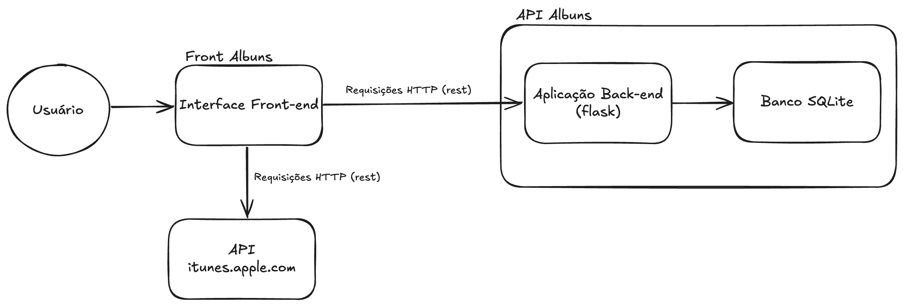

# Frontend Acervo Filmes

Frontend para a apicação api-filmes, para gerenciar filmes.

## Baixar o projeto

```bash
git clone https://github.com/FabioDouglass/front-albuns
cd front-filmes
```

## Rodar o Projeto

**1 - Construir a imagem Docker do projeto**

```
docker build -t front-albuns .

```

**2 - Iniciar o projeto**

```
docker run -p 8080:80 front-albuns

```

## Acessar Documentação

Componente backend implementado: acesse [http://127.0.0.1:5001/docs](http://127.0.0.1:5001/docs) no navegador enquanto estiver rodando o projeto api-albuns, dispovível em [https://github.com/FabioDouglass/api-albuns](https://github.com/FabioDouglass/api-albuns)

API Externa: acesse [https://performance-partners.apple.com/search-api](https://performance-partners.apple.com/search-api)
Para o requisito de consumo de api externa, foi utilizada a API gratuita do iTunes. Conforme demonstrado na documentação no link acima, o acesso é realizado apenas através da montagem da URL indicada, sem a necessidade de tokens de autenticação.
Para este projeto, foi utilizado o term={titulo_ou_cantor}&entity=album para a consulta dos álbuns.
E também a lookup?id={collectionId}&entity=song para buscar as especificações de um determinado álbum, como a lista de músicas.

## Fluxograma da Arquitetura da serviço

---


